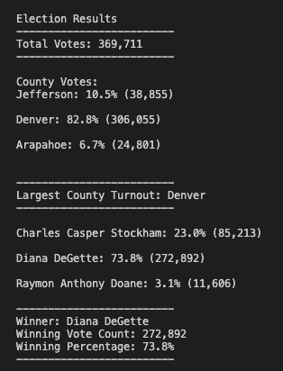

# Election_Analysis

## Project Overview
In this project, I assist a Colorado Board of Election employee, Tom, in completing the election audit of the tabulated results for the US Congressional precinct in Colorado. My tasks were to report the following items.

1. The total number of votes cast.
2. The total votes and the vote percentage of each county.
3. The county with the largest voter turnout.
4. A complete list of candidates who received votes.
5. The total votes and the vote percentage of each candidate.
6. The winner of the election and their winning vote count and vote percentage.

## Resources
- Data Source: election_results.csv
- Software: Python 3.7.6 Visual Studio Code 1.66.2

## Election Audit Result

The analysis of the election showed that:
- There were totally 369,711 votes cast in this congressional election.
- The vote details for each county were:
    - Jefferson contributed 38,855 votes, which was 10.5% of the total votes.
    - Denver contributed 306,055 votes, which was 82.8% of the total votes.
    - Arapahoe contributed 24,801 votes, which was 6.7% of the total votes.
- Denver was the county that had the largest number of votes.
- The candidate results were:
    - Charles Casper Stockham won 85,213 votes, which was 23.0% of the total votes.
    - Diana DeGette won 272,892, which was 73.8% of the total votes.
    - Raymon Anthony Doane won 11,606, 3.1% of the total votes.

- The winner of the election was:
    - Diana DeGette. She received 272,892 votes and 73.8% of the total votes.

## Election-Audit Summary: 

This Election-Audit script can be scaled up or down to be applied to elections of different levels with some proper modifications. For example, change the county to state or district to get the analysis result for president or Mayor elections. 

This script also has a wide range of users. Some extra analysis could be added to further the depth of the audit, such as the turnout rate of each county, and the breakout of the county votes that each candidate won, especially the winner's votes. With those data, we could see if certain counties prefer specific candidates and check the correlation between the turnout rate and candidate's lobby efforts in each county. Future candidates can use this to help set up their lobby strategies and budget allocation. 
